#AD #Windows #GPPEncrypot #KerberosAttack 
____
# Resumen

Active es una máquina de dificultad fácil a media, que presenta dos técnicas muy frecuentes para obtener privilegios dentro de un entorno Active Directory.

___

Primero, se realizó un escaneo con _RustScan_ con el objetivo de identificar posibles vectores de ataque para facilitar una intrusión. Sin embargo, no se encontraron resultados relevantes.

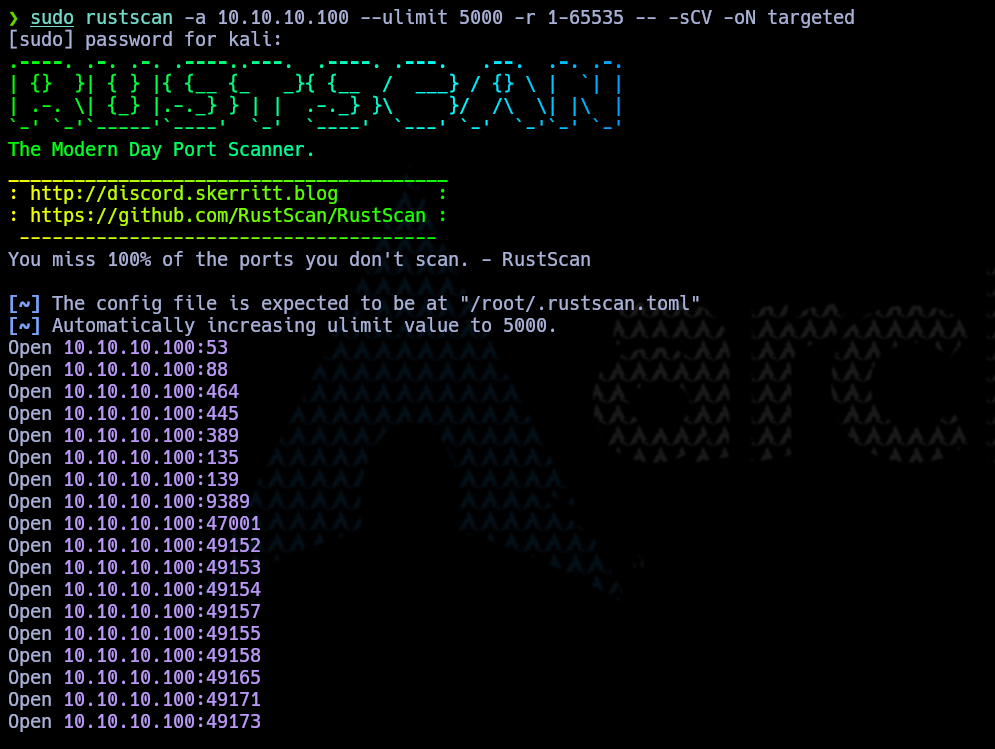

> *Escaneo con RUSTSCAN*

Posteriormente, se utilizó SMBMap para verificar la existencia de recursos compartidos accesibles sin necesidad de autenticación. Como resultado, se identificaron dos recursos: Users y Replication. Sin embargo, solo se tenía acceso al recurso Replication, mientras que Users requería autenticación.

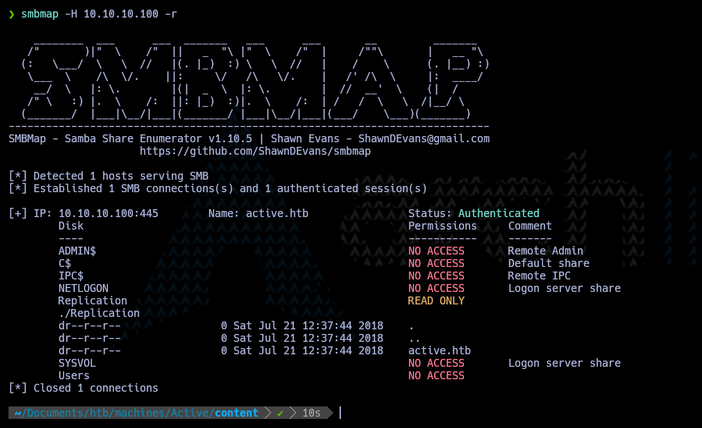]

> *Recursos Compartido identificados*

Luego de enumerar el recurso compartido _Replication_, se identificó un archivo denominado _Groups.xml_.

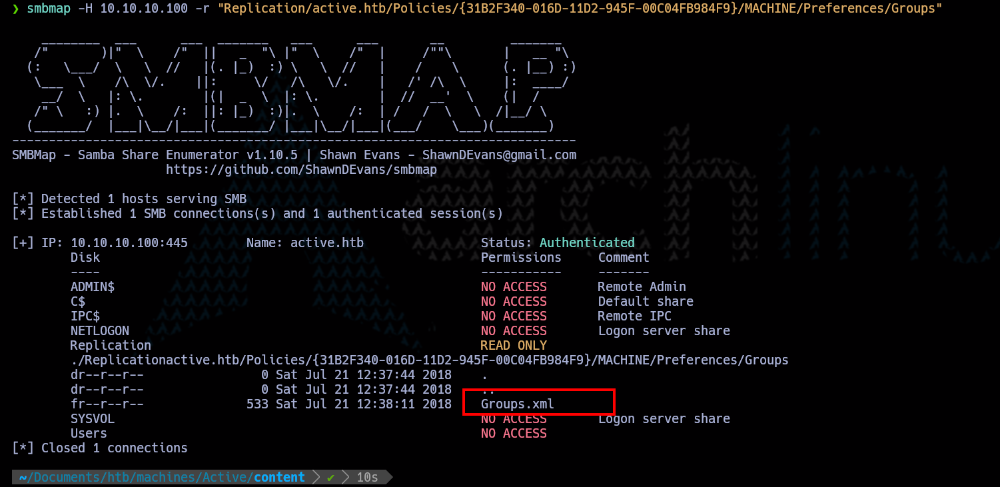

> *Archivo Groups encontrado*

Se procedió a descargar el archivo _Groups.xml_ y, al abrirlo, se identificó un usuario junto con una contraseña aparentemente hasheada.

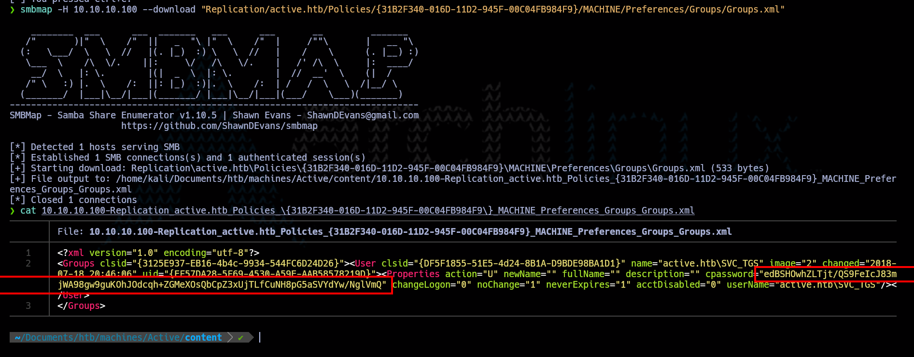

> *Información encontrada *

Tras un análisis exhaustivo, se determinó que la contraseña encontrada en _Groups.xml_ estaba almacenada en las _Group Policy Preferences (GPP)_ de Microsoft. Esto se debe a que, en versiones antiguas de Windows, las contraseñas establecidas a través de las preferencias de directivas de grupo eran cifradas utilizando una clave AES estática, la cual es pública y bien conocida. Este fallo de seguridad permite recuperar la contraseña sin necesidad de descifrarla manualmente, representando una vulnerabilidad crítica en entornos mal configurados [Más Información](https://informaticamadridmayor.es/tips/seguridad-de-contrasena-con-preferencias-de-politica-de-grupo/)

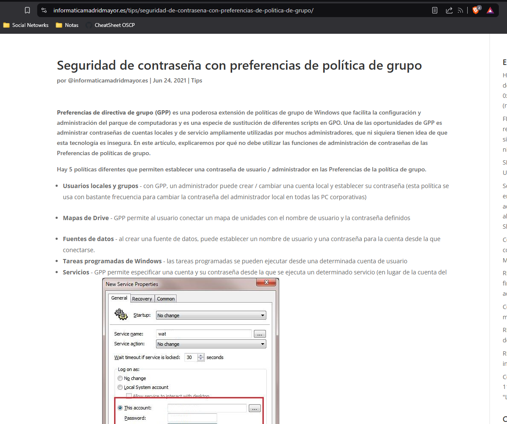

> *GPP de Microsoft*

Después de investigar herramientas especializadas en la recuperación de contraseñas almacenadas en _Group Policy Preferences (GPP)_, se identificó una llamada _gpp-decryptor_. Esta herramienta, diseñada específicamente para descifrar las contraseñas cifradas con la clave estática de Microsoft, permitió obtener la contraseña en texto claro, proporcionando así credenciales válidas para la intrusión. A continuación, se muestra el uso de _gpp-decryptor_ y su resultado exitoso en la recuperación de la contraseña.

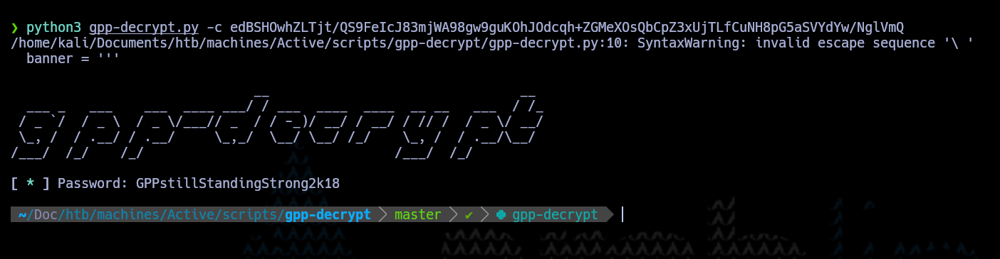

Con la ayuda de _nexec_, se procedió a validar si las credenciales obtenidas permitían el acceso al recurso compartido _Users_. La autenticación fue exitosa, lo que permitió enumerar los archivos dentro del recurso. Como resultado, se logró acceder a la primera _flag_, marcando un avance significativo en la intrusión.

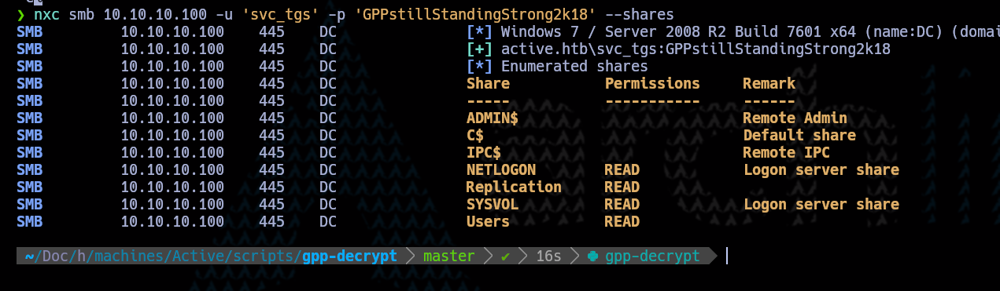

> *Acceso valido al recurso Users*

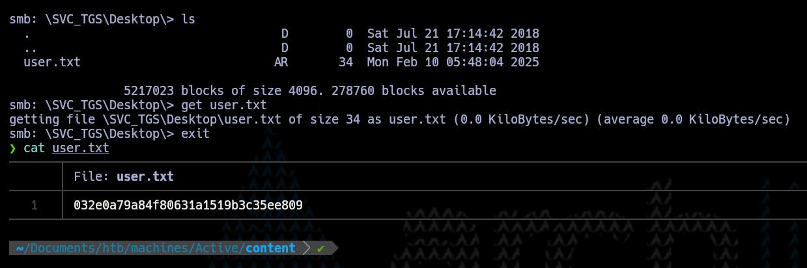

> *Flag user*

Continuando con la escalada de privilegios, se identificó que, además de contar con credenciales de un usuario válido, el puerto 88 (Kerberos) estaba abierto. Esto permitió ejecutar un ataque de _Kerberoasting_, una técnica que consiste en solicitar un _Ticket Granting Service (TGS)_ de un servicio expuesto en Active Directory. Dado que estos tickets están cifrados con la clave NTLM del usuario asociado al servicio, pueden ser extraídos y sometidos a un proceso de fuerza bruta o ataque de diccionario para recuperar la contraseña en texto claro. Esta estrategia es particularmente efectiva contra cuentas de servicio que utilizan contraseñas débiles o que no han sido rotadas en un largo período de tiempo.

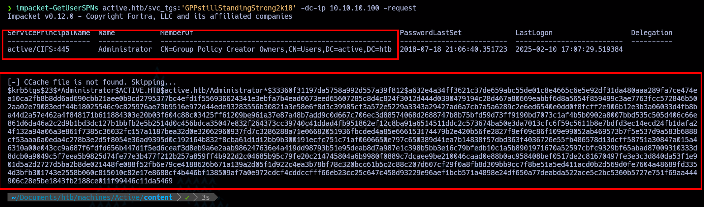

> *Kerberoasting Attack*

Una vez obtenido el _TGS_ y verificado que pertenece a la cuenta del administrador del sistema, se procedió a someterlo a un proceso de crackeo utilizando _Hashcat_. Esta poderosa herramienta permitió descifrar el hash mediante ataques de diccionario o fuerza bruta, logrando así recuperar la contraseña en texto claro del usuario administrador

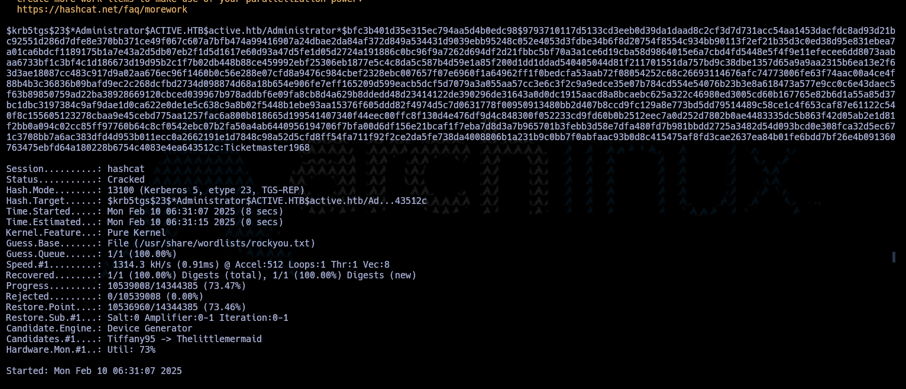

> *Crackeo de TGS*

Con estas credenciales en mano, se procedió a validar su autenticidad. Tras confirmar que eran correctas, se logró acceder con privilegios administrativos, obteniendo así control total sobre el sistema. Como resultado, se completó con éxito la escalada de privilegios y se consiguió la _flag_ de administrador.

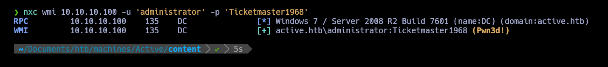

> *Validación de credenciales*

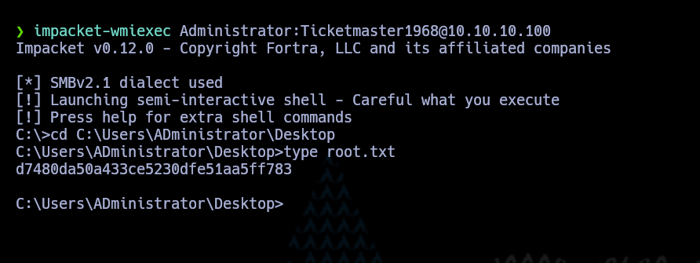

> *Flag Administrador*
