#HackDef #Pwning #BOF 
___

Durante el CTF nacional organizado por Hackdef en Guadalajara, se llevó a cabo un desafío muy interesante con temática de explotación binaria. Este writeup tiene como objetivo compartir mi experiencia, ya que después de casi un año de estudio y aprendizaje sobre explotación binaria, finalmente me siento preparado para abordar este tema. Hoy les traigo un pequeño writeup elaborado por mí, **YukaFake**, en el que detallo los pasos y conocimientos adquiridos a lo largo de este proceso.

----

# Desafio

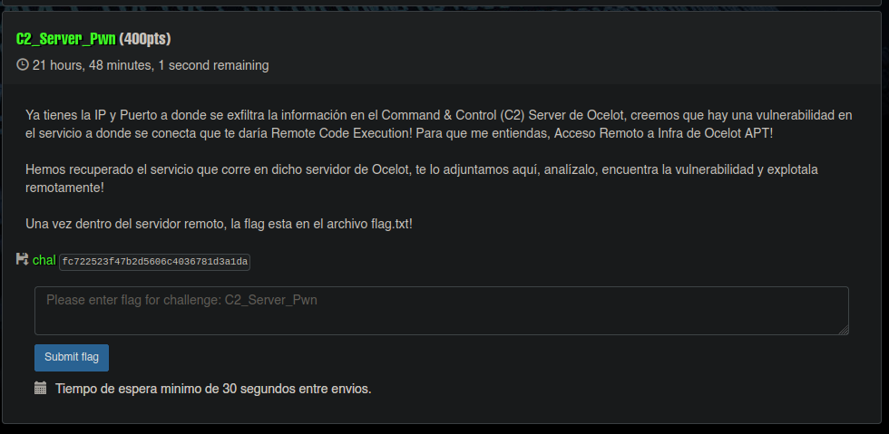

Se nos proporcionó un binario, el cual se verificó inicialmente para determinar su tipo y comprobar si presenta alguna restricción. Para ello, utilizamos la herramienta **checkfile**.

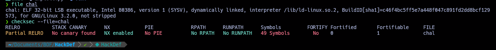

Posteriormente se decidio ejecutar el binario logrando observar que el flujo de este servicio muestra que el binario está diseñado para recibir y exfiltrar datos. Tras recibir la letra "A", el programa indica que los datos han sido exfiltrados exitosamente, lo que sugiere que el binario realiza alguna operación relacionada con la captura o transferencia de información a un destino externo. Esto podría ser parte de un desafío de CTF o un ejercicio de análisis de seguridad, enfocado en la explotación de vulnerabilidades de exfiltración de datos.

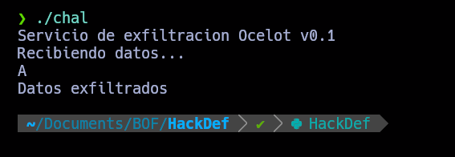

Al no entender completamente el funcionamiento del programa, decidimos proceder con el análisis estático: descompilamos y desensamblamos el binario para comprender la lógica detrás del código.

Al decompilarlo utilizando **Binary Ninja**, obtuvimos el siguiente resultado:

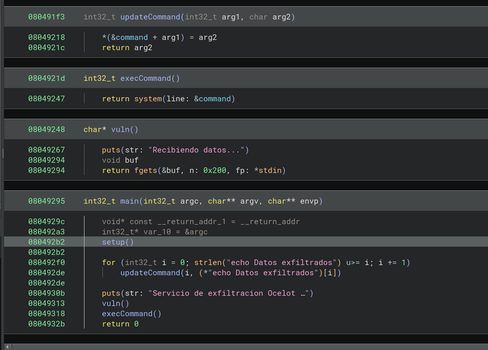

Para comprender mejor lo que está sucediendo, analizaremos cada una de las funciones involucradas. Comencemos por examinar la función **`main()`**.

### Desglose del flujo en **`main`**:

1. **Iteración sobre la cadena `"echo Datos exfiltrados"`**:
    
    - El bucle **`for (int32_t i = 0; i < strlen("echo Datos exfiltrados"); i++)`** recorre la cadena.
        
    - En cada iteración, el índice **`i`** se incrementa, y el valor correspondiente en la cadena **`(*"echo Datos exfiltrados")[i]`** es pasado como argumento a la función **`updateCommand(i, ...)`**, que coloca el carácter en el arreglo **`command`**.
        
2. **Construcción dinámica del comando**:
    
    - La función **`updateCommand`** asigna cada carácter a **`command[arg1]`** en su respectiva posición, creando de esta manera una cadena de caracteres completa que forma el comando `"echo Datos exfiltrados"`.
        
    - Este comando es construido de manera incremental y progresiva en cada iteración del bucle, lo que indica que se está construyendo un comando dinámico, posiblemente para ser ejecutado más tarde por la función **`execCommand`**.
        
3. **Llamada a `vuln()`**:
4. **Y sale con un código de estado 0**, indicando que fue exitoso 

Ahora, analicemos qué está sucediendo en la función **`vuln()`**.

Algo interesante ocurre aquí: el tamaño de los datos que **`fgets()`** intenta recibir es de **0x200 bytes** (512 en decimal), pero el buffer disponible tiene un tamaño de **268 bytes** (0x10c). Esto genera un **desbordamiento de buffer**. En otras palabras, al intentar almacenar más datos de los que el buffer puede manejar, los datos adicionales sobrescriben áreas adyacentes de memoria, lo que puede alterar el comportamiento del programa y, en muchos casos, permitir la explotación de la vulnerabilidad para ejecutar código arbitrario.

Utilizando **gdb-pwning**, intentamos enviar un payload para explotar la vulnerabilidad de desbordamiento de buffer. El payload se construye de la siguiente manera:

1. **`b"A" * 268`**:
    - Se genera una secuencia de **268 caracteres 'A'**. Esta parte del payload sirve para llenar el buffer de 268 bytes (**0x10c**), que es el tamaño del buffer vulnerable en la función **`vuln()`**. Este relleno asegura que los primeros 268 bytes de la entrada sobrescriban la memoria dentro de los límites del buffer. Este paso es crítico porque el propósito es llenar el buffer hasta el punto de sobrescribir la memoria adyacente, incluida la dirección de retorno.
2. **`b"B" * 4`**:
    - A continuación, se añaden **4 bytes de 'B'**. Estos 4 bytes corresponden a la **dirección de retorno** que queremos sobrescribir. Al enviar estos bytes, estamos intentando manipular la dirección de retorno del programa para redirigir su flujo de ejecución a una dirección controlada por el atacante. Los **4 bytes de 'B'** se corresponden con la nueva dirección que el atacante desea inyectar, y si esta dirección está alineada correctamente, el programa saltará a esa ubicación.
3. **`b"C" * 20`**:
    - Finalmente, se agregan **20 caracteres 'C'**. Estos 20 bytes son solo un relleno adicional, enviados para llenar la memoria restante después de los bytes que controlan la dirección de retorno. Aunque no tienen un propósito crítico en la explotación, se utilizan para garantizar que se llene la entrada con datos adicionales y asegurar que no se quede espacio vacío en el buffer.

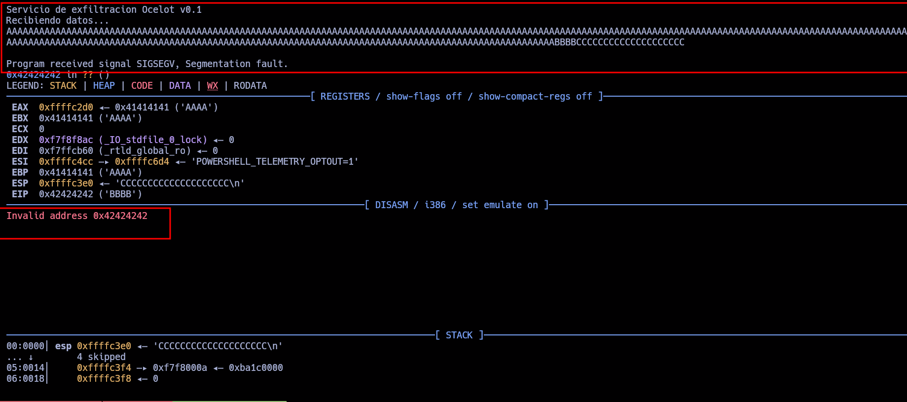

**Observación interesante**: Después de enviar el payload, notamos que la dirección de retorno a la que está apuntando el programa es **0x42424242**, que corresponde a las 4 **'B'**. Esto ocurre debido a un fenómeno que se genera como consecuencia del **desbordamiento de buffer**.

### ¿Por qué sucede esto?

Este comportamiento ocurre porque el **desbordamiento de buffer** sobrescribe la dirección de retorno almacenada en la pila, lo que provoca que el programa ejecute una dirección de memoria que no estaba prevista. En este caso, la dirección **0x42424242** es precisamente la dirección que hemos inyectado a través de las 4 **'B'** en el payload. Dado que el programa no verifica adecuadamente los límites del buffer, sobrescribe los valores de la pila, incluyendo la dirección de retorno, lo que provoca que el programa intente saltar a esa dirección, aunque **0x42424242** no es una dirección válida de ejecución.

### Para entenderlo mejor:

Para comprender este comportamiento en detalle, debemos examinar el **código desamblado** de la función **`vuln()`**. Al hacerlo, podremos ver cómo se maneja el buffer, cómo se almacenan los valores en la pila, y cómo la sobrescritura de la dirección de retorno con las 4 **'B'** lleva al programa a intentar ejecutar la dirección **0x42424242**.

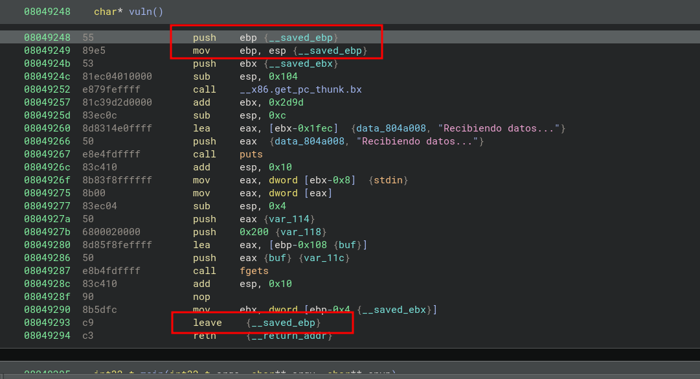

En la función **`vuln()`**, observamos lo siguiente en el código desamblado:

1. **Guardado del valor de `ebp`**:
    - Al principio, el valor de **`ebp`** (el puntero de base) se guarda en la pila utilizando la instrucción **`push ebp`**.
    - Esto es una técnica estándar utilizada para preservar el contexto de la función anterior, de modo que pueda restaurarse cuando se termine la ejecución de la función actual.
        
2. **Cambio de `ebp` y `esp`**:
    - Luego, **`mov ebp, esp`** mueve el valor de **`esp`** (el puntero de pila) a **`ebp`**.
    - Esto establece un nuevo marco de pila (stack frame) para la función **`vuln()`** y permite acceder a los parámetros locales y las variables de la función mediante desplazamientos relativos desde **`ebp`**.
    
3. **Uso de `fgets()`**:
    - En este punto, se realiza una llamada a **`fgets()`**, la cual lee datos desde **`stdin`** y los almacena en el buffer **`buf`**. El tamaño de lectura es de 512 bytes, lo que puede generar un desbordamiento de buffer si se proporcionan más datos de los que el buffer puede manejar (268 bytes en este caso).
        
4. **Restauración del valor de `ebp`**:
    - Al final de la función, encontramos la instrucción **`leave`**.
    - **`leave`** realiza lo contrario de lo que hizo al principio: restaura el valor de **`ebp`** desde la pila, devolviendo el **`esp`** a su estado original. Esto es equivalente a **`mov esp, ebp`** y **`pop ebp`**.
    - Después de ejecutar **`leave`**, la ejecución se prepara para regresar a la dirección almacenada en **`ebp+4`**, es decir, a la dirección de retorno de la función.
    
5. **Instrucción de retorno**:
    - Finalmente, **`ret`** se ejecuta, devolviendo el control al punto de la llamada a la función, usando la dirección almacenada en **`ebp+4`**.

Al hacer debugging del programa, lo visualizamos de la siguiente manera:

Estableceremos un **breakpoint** justo antes de la llamada a **`fgets()`** para entender por qué la dirección **0x42424242** es la que se está utilizando. Luego, enviamos nuestro payload de **'A'** y continuamos avanzando hasta llegar a un punto clave.

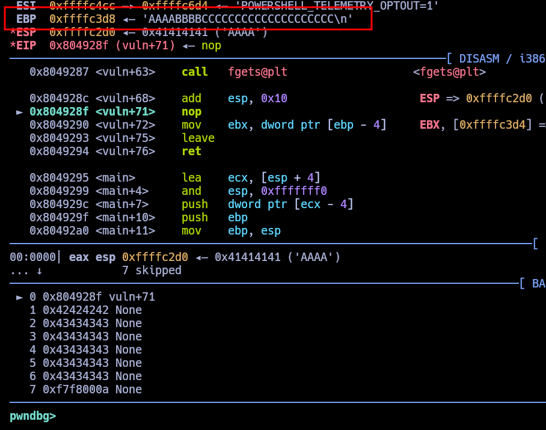

En primer lugar, el valor de **EBP** tomará los primeros **4 bytes** de lo que enviamos inicialmente, es decir, las **'A'**. Esto sucede porque estamos trabajando en una arquitectura de **32 bits**, donde cada valor de la pila ocupa **4 bytes**. Este comportamiento es típico en sistemas de 32 bits, ya que los punteros y direcciones son de 4 bytes.

Luego, cuando llegamos a la instrucción **`leave`** (que es equivalente a **`mov esp, ebp; pop ebp`**), se realiza lo siguiente:

- **`mov esp, ebp`**: El puntero de pila (**`esp`**) se ajusta al valor de **`ebp`**.
- **`pop ebp`**: El valor de **`ebp`** se restaura desde la pila.

Aquí es donde el valor de **EBP** se ve afectado. Al ejecutar el **`leave`**, el **EBP** toma el valor de las **'A'** que enviamos en el payload, y debido al desbordamiento de buffer, en la pila quedaron las **'B'** y **'C'**. Es por eso que, cuando el programa intenta regresar a la dirección de retorno, utiliza las **'A'**, que ahora están ocupando el espacio de la dirección de retorno.

Al final, el flujo del programa regresa a la dirección **0x42424242**, que corresponde a los **4 bytes de 'A'** que sobrescribieron la dirección de retorno.

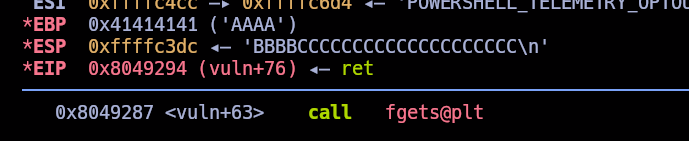

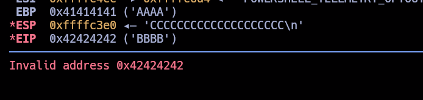

Ahora que hemos logrado controlar la dirección de retorno, podemos comenzar a escribir nuestro script de explotación.

Empecemos desglosando nuestro script por partes

Vamos a desglosar el script **`exploit.py`** línea por línea y explicar cómo funciona:

### 1. **Inicialización del Proceso**:

**`process("./chal")`**: Inicia el proceso del binario **`chal`** que es el que estamos explotando.
**`gdb.debug`**: Esta línea está comentada, pero en caso de descomentarla, lanzaría el binario en **gdb** con el control sobre la ejecución. Aquí no la estamos utilizando, pero si quisiéramos hacer una depuración interactiva, esta es la línea que usaríamos.
### 2. **Configuración del Offset y Payload Inicial**:

- **`offset = 268`**: Esto establece la cantidad de bytes necesarios para llegar a la dirección de retorno (basado en el tamaño del buffer y el desbordamiento). Se calcula previamente durante la explotación.    
- **`junk = b"A" * offset`**: Se genera una secuencia de **268 bytes de 'A'** que servirán para llenar el buffer hasta el punto en que sobrescriba la dirección de retorno.

### 3. **Comando de la Shell**:

- **`cmd = b"/bin/bash\x00"`**: Este es el comando que queremos ejecutar una vez que obtengamos el control sobre el flujo de ejecución. En este caso, estamos tratando de ejecutar una shell interactiva de Bash.    
### 5. **Bucle para Sobrescribir Dirección de Retorno y Enviar Comando**:

- **Bucle sobre `cmd`**: Este bucle recorre cada carácter del comando **`/bin/bash`**.
    
    - **`payload = b""`**: Inicializa el payload en cada iteración como un byte vacío.
    - **`payload += junk`**: Se agrega el relleno de **'A'** para llenar el buffer hasta la dirección de retorno.
    - **`payload += p32(0x80491f3)`**: Se agrega la dirección de la función **`updateCommand`**. Esta es la dirección que se invocará durante el desbordamiento del buffer.
    - **`payload += p32(0x8049248)`**: Se agrega la dirección de la función **`vuln`**. Esto también se llama en el proceso de desbordamiento.
    - **`payload += p32(i)`**: Se agrega el índice actual del bucle **`i`**, lo cual se usa para iterar por cada carácter del comando.
    - **`payload += p32(u8(cmd[i:i+1]))`**: Convierte el carácter actual del comando **`cmd[i:i+1]`** en su valor **ASCII** (usando **`u8`**) y lo agrega al payload.
    - **`shell.sendlineafter(b"...\n", payload)`**: Después de preparar el payload, lo envía al binario usando **`sendlineafter`**, esperando la cadena **`"...\n"`** para que se envíe el payload de forma adecuada.

### **Interacción con la Shell**:

- **`shell.interactive()`**: Permite la interacción con la shell que hemos abierto en el paso anterior. Esto hace que el programa pase al modo interactivo, donde el atacante puede ingresar comandos en la shell obtenida.

Si juntamos todo esto obtenemos lo siguiente 

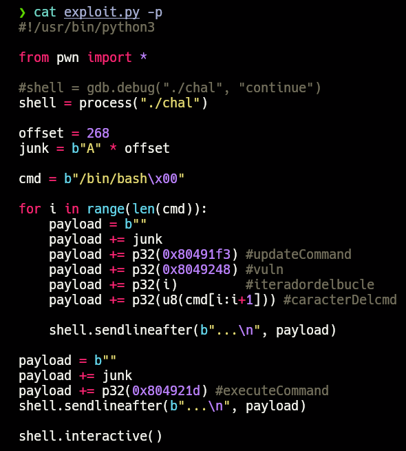

**Nota**: Utilizamos el payload una vez más, junto con la dirección de **`execCommand`**, porque, después de completar el barrido de caracteres uno por uno, necesitamos sobrescribir la memoria una vez más para redirigir la ejecución y llamar a la función **`execCommand`**. Esto nos permitirá finalmente ejecutar el comando **`/bin/bash`** y obtener la shell.

En resumen, nuestro exploit aprovecha el **desbordamiento de buffer** para sobrescribir la memoria de manera iterativa, enviando cada carácter de **`/bin/bash`** uno por uno en un bucle. Sin embargo, para lograr esto, necesitamos que, después de cada iteración del desbordamiento de buffer, el programa entre en un bucle. Una vez que todos los caracteres de **`/bin/bash`** hayan sido enviados, realizamos una última sobrescritura de la memoria para redirigir la ejecución a la función **`execCommand`**, lo que nos permitirá obtener una shell interactiva.

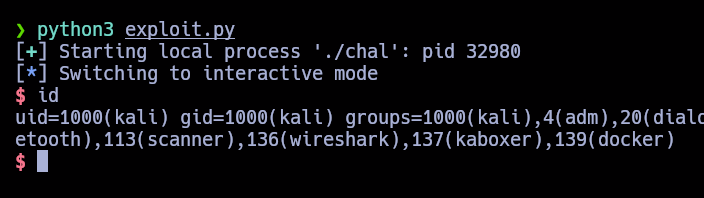

Y seria todo por este desafío :)

Gracias a xchg2pwn por siempre estar dispuesto a enseñar sobre estos temas, saludos crack!!!

