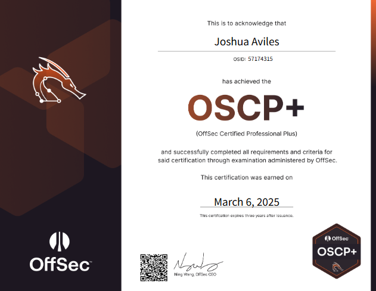

# Mi experiencia con la Offensive Security Certified Professional (OSCP) 2025

6 Mar 2025

El 28 de febrero de 2025, después de dos meses de preparación, decidí presentarme al examen OSCP, confiando en el esfuerzo que había dedicado. El 6 de marzo de 2025, recibí la noticia de que había aprobado la certificación con éxito, lo cual me llenó de gratitud y satisfacción.o.

## Resumen

El OSCP es un examen 100% práctico que consta de pruebas de penetración en un entorno de laboratorio seguro. El examen OSCP+ requiere que los titulares ataquen y penetren con éxito varias máquinas activas, de las cuales 3 corresponden a un directorio activo y 3 son máquinas solitarias, para poder obtener el 100%. Se considera más técnico que otras certificaciones de pruebas de penetración y es uno de los pocos que exige pruebas de habilidades prácticas en este campo. Además, no se pueden usar herramientas automatizadas y el examen debe ser realizado completamente por una persona, quien debe compartir todas sus pantallas y su cámara durante el proceso. Al final, se entrega un reporte profesional detallado que incluye las acciones realizadas y capturas de las banderas necesarias para aprobar el examen.

## Sobre mi

> "Nunca dejes de aprender; el conocimiento es infinito y siempre hay algo nuevo por descubrir." Con esto en mente, te recomiendo aprovechar la Academia de HTB. Es una plataforma que te brindará una gran cantidad de recursos y desafíos que, en muchos casos, ofrecen incluso más de lo que puede ofrecer OffSec. Sin duda, es una excelente manera de seguir desarrollando tus habilidades en ciberseguridad.

Tengo 21 años y actualmente estoy cursando mis estudios universitarios. Trabajo como Junior Penetration Tester en Accenture México, donde he tenido la oportunidad de aplicar mis conocimientos en ciberseguridad y aprender de mis colegas del área. Esta experiencia me ha permitido seguir desarrollando mis habilidades y mantenerme en constante práctica y aprendizaje. Además, me dedico a resolver máquinas en Hack The Box (HTB) y he tenido el honor de ser coautor de una máquina llamada "Compiled", la cual ha sido subida a la plataforma de HTB.

## Lo bueno 

El OSCP es una certificación que ha ganado una gran popularidad en los últimos años y es considerada una de las más valoradas en el mercado de la ciberseguridad. Su creciente demanda se refleja en las numerosas oportunidades laborales que la requieren, lo que la convierte en una de las certificaciones más codiciadas por los profesionales del área.

El path que ofrece OffSec para esta certificación es muy completo. Te proporciona una base sólida sobre la metodología de un pentest, combinando teoría con prácticas esenciales. El material de estudio incluye videos detallados, laboratorios de simulación del examen y, lo más importante, un gran apoyo de la comunidad a través de su servidor de Discord, donde puedes resolver dudas y compartir experiencias con otros estudiantes.

Además, los laboratorios de OffSec están diseñados para replicar los escenarios que encontrarás durante el examen, lo que te permite prepararte de manera efectiva. Considero que este path es más que suficiente para afrontar el examen con confianza. Lo que realmente hace desafiante al OSCP es que, al completarlo, demuestras sin lugar a dudas tus conocimientos y habilidades prácticas en ciberseguridad.

## Lo malo 

> Lo que sigue se basa en mi propia experiencia con el curso y el examen, y puede no ser representativa de la experiencia de los demás.

En la sección anterior hablamos de lo bueno del OSCP, pero ahora es momento de abordar lo que considero los puntos negativos de esta certificación.

A nivel personal, siento que el OSCP es un examen más orientado a un nivel de entrada. En esencia, valida mucho los fundamentos y las bases del pentesting. Si ya tienes experiencia, has resuelto más de 100 máquinas en Hack The Box (HTB) y cuentas con una metodología sólida, te recomendaría considerar el OSEP, del cual hablaremos en otro momento.

Aunque el path de la OSCP es muy útil para pasar el examen, también creo que en algunos aspectos se queda corto. Algunas de las técnicas que enseña son algo antiguas, y eso lo coloca por detrás del path de la CPTS, que se lleva la delantera con actualizaciones más constantes, técnicas más modernas y una mejor explicación de los temas.

Respecto a los laboratorios, me parece que, en ocasiones, las soluciones parecen repetitivas, lo que puede resultar frustrante. He escuchado que incluso algunos laboratorios del examen real tienen problemas y pueden resultar excesivamente complicados. Además, hay temas en el contenido que también están desactualizados.

En resumen, para mí, el OSCP es una excelente certificación para quienes están comenzando en el mundo del pentesting. Si ya cuentas con experiencia y conocimientos previos, te sugeriría ir directamente por el OSEP. No obstante, no le resto mérito al OSCP, ya que te enseña a no depender de herramientas automatizadas ni de chat, lo cual es un gran valor. A pesar de la gran fama que tiene, mi opinión personal es que el OSCP es un examen relativamente fácil y de dificultad media baja en comparación con lo que muchos suelen decir.

## ¿Cómo me preparo?

Durante mi preparación para el examen OSCP, utilicé una técnica que considero bastante efectiva: me dediqué a estudiar el path día y noche, tomando notas detalladas de todos los puntos que no podía recordar con facilidad. Es fundamental identificar y reforzar las áreas en las que te sientes más débil, ya que, en mi caso, algunos temas ya los tenía cubiertos gracias a la experiencia adquirida resolviendo máquinas en Hack The Box (HTB).

Recomiendo especialmente realizar los siguientes laboratorios, que considero clave para la preparación del OSCP:

- Secura
- Medtech
- Relia
- OSCP A
- OSCP B
- OSCP C
- Laser

Además, en el futuro es posible que se incluyan temas relacionados con AWS, por lo que sugeriría que realices el laboratorio correspondiente de AWS. Realizar estos laboratorios y documentarlos como un writeup te permitirá estar más que preparado para el examen. También sugiero considerar el ProLab de Dante en la plataforma de HTB, así como el path "Intro to Zephyr", que abarca temas que no se cubren en la OSCP pero te proporcionarán una preparación aún más sólida.

Otro consejo importante es completar al menos 20 máquinas de la lista de NetSecFocus Trophy Room (puedes encontrarla [aquí](https://docs.google.com/spreadsheets/u/1/d/1dwSMIAPIam0PuRBkCiDI88pU3yzrqqHkDtBngUHNCw8/htmlview#)), lo que te ayudará a desarrollar memoria muscular y afianzar los conocimientos adquiridos.

Finalmente, nunca dudes en pedir ayuda si no sabes algo. El chat de Discord siempre será una fuente de respuestas y apoyo, así que no tengas miedo de preguntar. Mi recomendación es que hagas los laboratorios OSCP A, B y C de forma independiente, simulando las condiciones del examen: 24 horas de trabajo con todo documentado en el formato oficial de OSCP.

Con estas actividades, estarás más que listo para enfrentar el examen con confianza.

## Consejos y Trucos

- **Toma mucha agua**: Mantén una buena hidratación durante todo el proceso de preparación y el examen. Esto te ayudará a mantenerte enfocado.
- **No seas orgulloso, siempre pregunta**: No tengas miedo de pedir ayuda. El chat de Discord es una excelente comunidad de apoyo y siempre habrá alguien dispuesto a responder.
- **Lee reseñas de otras personas**: Las experiencias de otros estudiantes pueden ofrecerte perspectivas valiosas sobre cómo abordar el examen y mejorar tu preparación.
- **Descansa 24 horas antes del examen**: Asegúrate de tomarte un tiempo para relajarte y descansar antes de enfrentarte al examen. Esto te permitirá estar más fresco y concentrado.
- **Aprovecha los descansos durante el examen**: Recuerda que puedes pedir descansos si los necesitas. Utilízalos para despejarte y volver con más energía.
- **Hazte sí o sí el ProLab de Dante**: Este laboratorio es una excelente manera de prepararte, ya que cubre una amplia gama de técnicas que son útiles para el examen.
- **Repasa todo lo que te resulte débil**: Si tienes áreas donde te sientes menos seguro, como la escalada de privilegios en Windows, asegúrate de repasar esos temas antes del examen.
- **Piensa en lo más simple**: Durante el examen, no subestimes las soluciones más sencillas. Revisa la historia de PowerShell, tus privilegios de usuario, y usa comandos como `netstat` para obtener información útil.
- **Acostúmbrate a usar Powerview, BloodHound y netxec**: Estas herramientas serán tus mejores aliadas durante el examen. Aprender a usarlas eficientemente puede marcar la diferencia al interactuar con un directorio activo o al explorar redes.
- **Aprende a usar Ligolo**: Ligolo es una herramienta que te ayudará muchísimo durante el examen, especialmente en la comunicación con máquinas intermedias. No olvides activar la salida para el puerto que utilices, ya que el firewall de la máquina intermedia podría bloquearlo.
- **Revisa versiones de sudo, kernel y bash history**: Estas son áreas clave que pueden darte pistas valiosas para la escalada de privilegios.
- **Ten a la mano GTFOBins y WADComs**: Estas dos herramientas serán esenciales durante el examen. Considera que se convertirán en tu "biblia" para encontrar y ejecutar comandos útiles durante la prueba.
- **Sé curioso**: La curiosidad es crucial. Investiga todo lo que encuentres durante el examen. A menudo, los detalles más pequeños pueden ser la clave para avanzar.
- **Aprende varias formas de transferir archivos**: Es importatne siempre saber varias formas de trasnferir archivos, creeme